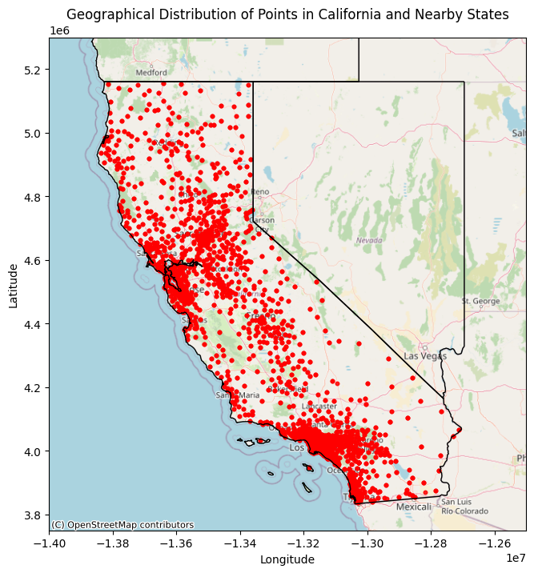
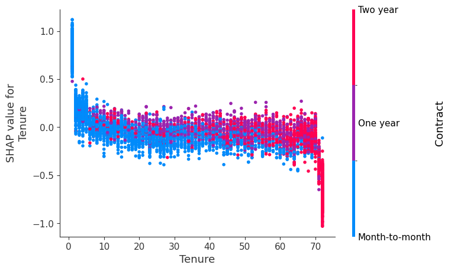

# Churn Prediction with SHAP


## 📌 Introduction

Welcome to the **Churn Prediction with SHAP** project. In this repository, I have developed a robust machine learning pipeline to predict customer churn in the telecommunications sector. My goal was not just to achieve high predictive accuracy, but to ensure that the model's decisions are transparent and interpretable.

To achieve this, I integrated **SHAP (SHapley Additive exPlanations)**, a cutting-edge method from cooperative game theory. This allows us to peer inside the "black box" of complex models like XGBoost and CatBoost, understanding exactly *why* a specific customer is at risk of leaving.

This project serves as a comprehensive guide to building trustworhy AI systems for business retention strategies.

## 📂 Project Structure

I have organized the project using a modular, object-oriented approach to ensure scalability and reproducibility.

- **`src/`**: Contains the core Python modules.
    - `data_viz.py`: My custom `EDA` class for automated data analysis and geospatial visualization.
    - `feature_eng.py`: Logic for encoding, scaling, and advanced feature selection (including BorutaShap).
    - `ml_model.py`: The `ModelPipeline` class that handles training, cross-validation, and metric tracking.
    - `exp.py`: Scripts for generating SHAP values and explainability plots.
- **`Data/`**: Contains the IBM Telco datasets.
- **`Notebooks`**:
    - `Exploratory.ipynb`: My detailed walkthrough of the data analysis phase.
    - `Classification.ipynb`: The training and evaluation of various machine learning models.
    - `SHAP.ipynb`: Deep dive into model interpretability.

## 📊 Exploratory Data Analysis (EDA)

I placed a strong emphasis on understanding the data before modeling. Using my custom `EDA` class, I performed:

*   **Geospatial Analysis**: Validated customer locations in California using **GeoPandas**.
*   **Distribution Analysis**: Examined the skew and spread of numerical features.
*   **Correlation Checks**: Identified key relationships between demographics, services, and churn.



## 🧠 Machine Learning Pipeline

I implemented a flexible pipeline capable of training and comparing multiple models:

*   **Logistic Regression**
*   **Random Forest**
*   **XGBoost**
*   **CatBoost** (Optimized for categorical data)

### Handling Imbalanced Data
Since churn is a rare event, I employed advanced sampling techniques to ensure the model learns effectively:
*   **SMOTE** (Synthetic Minority Over-sampling Technique)
*   **ADASYN**
*   **Stratiifed K-Fold Cross-Validation**: To guarantee robust and unbiased performance metrics.

## 🔍 Explainability with SHAP

The core innovation of this project is the integration of SHAP. I moved beyond simple feature importance charts to provide:

*   **Global Interpretability**: Which features drive churn across the entire customer base? (e.g., Contract Type, Tenure).
*   **Local Interpretability**: Why did *Customer X* specifically churn? (e.g., High monthly charges combined with a month-to-month contract).



## 🚀 Getting Started

To replicate my results or extend this work:

1.  **Clone the repository**:
    ```bash
    git clone https://github.com/karthikeya1220/Churn-Prediction-with-SHAP.git
    cd Churn-Prediction-with-SHAP
    ```

2.  **Install dependencies**:
    I recommend using a virtual environment with Python 3.11.
    ```bash
    pip install -r requirements.txt
    ```

3.  **Run the analysis**:
    You can explore the notebooks in the order: `Exploratory.ipynb` -> `Classification.ipynb` -> `SHAP.ipynb`.

## 📬 Contact

**Darshan Karthikeya**  
*Data Scientist & Engineer*

Feel free to reach out if you have questions or want to collaborate on similar projects!